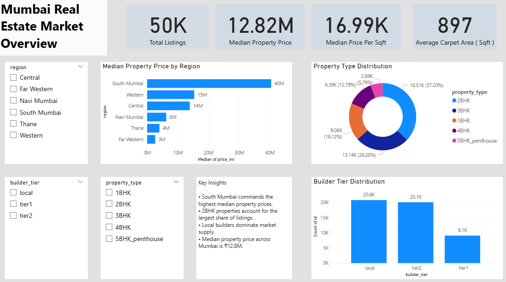
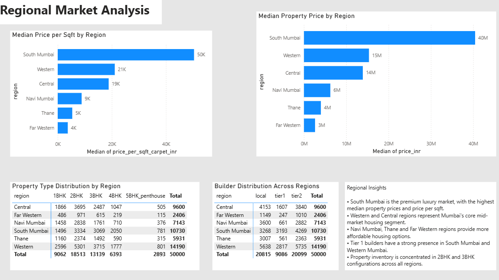
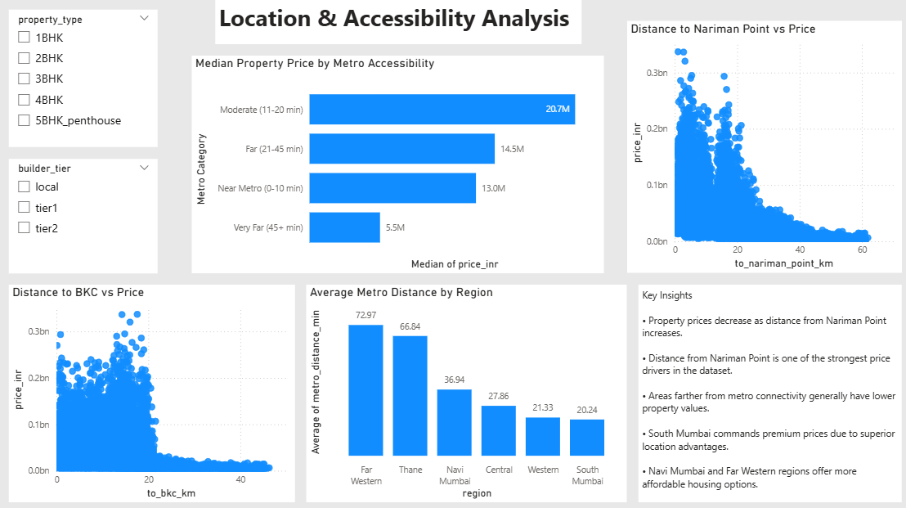
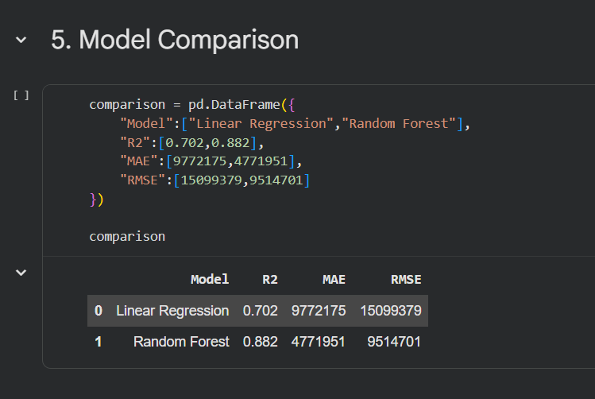

# Mumbai Real Estate Market Analysis & Price Prediction

## Project Summary

An end-to-end data analytics project analyzing 50,000 Mumbai residential property listings to identify key price drivers, generate business insights, build a machine learning price prediction model, and develop an interactive Power BI dashboard.

### Key Results

- Analyzed 50,000 residential property listings across Mumbai
- Identified major pricing drivers including carpet area and location
- Built a Random Forest Regression model with **R² = 0.882**
- Developed a 3-page interactive Power BI dashboard
- Generated actionable insights on regional markets and accessibility

---

## Dashboard Preview

### Executive Overview



### Regional Market Analysis



### Location & Accessibility Analysis



---

## Repository Structure

```text
Mumbai-Real-Estate-Analysis/

├── data/
│   └── sales.csv
│
├── notebooks/
│   ├── 01_Data_Understanding.ipynb
│   └── 02_Price_Prediction.ipynb
│
├── dashboard/
│   └── Mumbai_Real_Estate_Dashboard.pbix
│
├── images/
│   ├── dashboard_page1.png
│   ├── dashboard_page2.png
│   ├── dashboard_page3.png
│   └── model_results.png
│
├── requirements.txt
│
└── README.md
```

---

# Project Overview

This project analyzes residential property listings from Mumbai to understand the factors influencing property prices and build a machine learning model capable of predicting property values.

The project combines:

- Exploratory Data Analysis (EDA) using Python
- Machine Learning using Random Forest Regression
- Interactive Business Intelligence Dashboard using Power BI

The objective was to uncover market trends, identify key pricing drivers, and develop a predictive model that can estimate property prices based on property characteristics and location factors.

---

# Dataset Information

### Dataset

Mumbai Real Estate Sales Dataset (2020–2026)

### Dataset Size

- 50,000 Property Listings
- 32 Features
- No Missing Values

### Key Attributes

- Region
- Locality
- Property Type
- Bedrooms
- Carpet Area
- Built-up Area
- Floor
- Year Built
- Furnishing Status
- Builder Tier
- Metro Distance
- Distance to BKC
- Distance to Nariman Point
- Property Price

---

# Tools & Technologies

### Programming & Analysis

- Python
- Pandas
- NumPy
- Matplotlib
- Seaborn
- Scikit-Learn

### Business Intelligence

- Power BI

---

# Exploratory Data Analysis

The analysis focused on understanding pricing behavior across different regions, property types, builders, and accessibility factors.

## Regional Market Analysis

Median property prices revealed three distinct market segments across Mumbai:

| Region | Median Price (₹) |
|----------|----------:|
| South Mumbai | 40.46M |
| Western | 15.37M |
| Central | 13.92M |
| Navi Mumbai | 6.24M |
| Thane | 4.00M |
| Far Western | 2.63M |

### Key Finding

South Mumbai forms the premium luxury market, while Navi Mumbai, Thane, and Far Western represent more affordable housing markets.

---

## Property Type Analysis

| Property Type | Listings |
|--------------|---------:|
| 2BHK | 18,513 |
| 3BHK | 13,139 |
| 1BHK | 9,062 |
| 4BHK | 6,393 |
| 5BHK Penthouse | 2,893 |

### Key Finding

2BHK properties account for the largest share of the Mumbai residential market.

---

## Metro Accessibility Analysis

Properties were categorized into:

- Near Metro (0–10 min)
- Moderate (11–20 min)
- Far (21–45 min)
- Very Far (45+ min)

### Median Property Price by Metro Accessibility

| Metro Category | Median Price (₹) |
|---------------|-------------:|
| Moderate | 20.7M |
| Far | 14.5M |
| Near | 13.0M |
| Very Far | 5.5M |

### Key Finding

Properties located far from metro connectivity generally have significantly lower prices.

---

## Builder Tier Analysis

### Median Property Price by Builder Tier

| Builder Tier | Median Price (₹) |
|-------------|-------------:|
| Tier-1 | 23.6M |
| Tier-2 | 13.1M |
| Local | 9.7M |

### Key Finding

Tier-1 builders consistently command premium pricing across Mumbai regions.

---

## Area vs Price Analysis

Correlation between Carpet Area and Property Price:

```text
Correlation = 0.60
```

### Key Finding

Larger properties generally have higher prices, although location also plays a significant role.

---

## Location Impact Analysis

### Correlation with Property Price

| Variable | Correlation |
|----------|------------:|
| Distance to Nariman Point | -0.57 |
| Distance to BKC | -0.31 |
| Metro Distance | -0.23 |

### Key Finding

Distance from Nariman Point emerged as one of the strongest pricing drivers in the dataset.

---

# Machine Learning Model

## Objective

Predict residential property prices using property characteristics and location attributes.

### Features Used

- Region
- Property Type
- Bedrooms
- Carpet Area
- Floor
- Year Built
- Builder Tier
- Metro Distance
- Distance to BKC
- Distance to Nariman Point
- Furnishing Status
- Parking

---

## Model

### Random Forest Regressor

The model was trained using engineered categorical and numerical features after preprocessing.

---

## Model Performance

| Metric | Value |
|----------|---------:|
| MAE | ₹4.77M |
| RMSE | ₹9.51M |
| R² Score | 0.882 |

### Model Evaluation



### Result

The model successfully explains approximately **88% of the variation in property prices**, demonstrating strong predictive performance.

---

## Feature Importance

Top predictors identified by the model:

1. Carpet Area
2. Distance to Nariman Point
3. Distance to BKC
4. Bedrooms
5. Metro Distance

### Business Interpretation

Property size and location accessibility are the primary drivers of residential property prices in Mumbai.

---

# Power BI Dashboard

An interactive 3-page dashboard was developed to present business insights.

## Page 1: Executive Overview

Includes:

- Total Listings
- Median Property Price
- Median Price per Sqft
- Average Carpet Area
- Property Type Distribution
- Builder Tier Distribution
- Regional Pricing Overview

---

## Page 2: Regional Market Analysis

Includes:

- Median Price by Region
- Median Price per Sqft by Region
- Property Type Distribution Across Regions
- Builder Tier Distribution Across Regions
- Regional Insights

---

## Page 3: Location & Accessibility Analysis

Includes:

- Median Price by Metro Accessibility
- Property Price vs Distance to Nariman Point
- Property Price vs Distance to BKC
- Average Metro Distance by Region
- Location-Based Market Insights

---

# Key Business Conclusions

- South Mumbai represents the premium residential market in Mumbai.
- Distance from Nariman Point is one of the strongest drivers of property prices.
- Metro accessibility significantly impacts housing affordability.
- Tier-1 builders command substantial pricing premiums.
- Carpet area remains the most influential property characteristic.
- Property prices are driven by both size and location factors.

---

# Project Outcome

This project demonstrates an end-to-end data analytics workflow:

- Data Exploration
- Business Analysis
- Data Visualization
- Machine Learning
- Dashboard Development
- Insight Generation

The final solution combines predictive analytics with business intelligence to better understand Mumbai's residential real estate market.
